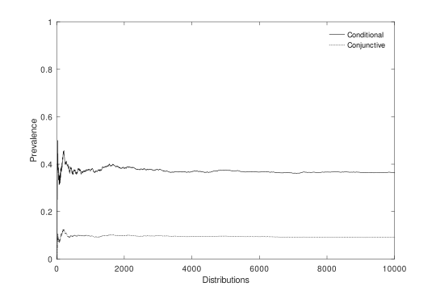

# How Prevalent is Transitivity-Failure in Bayesian Confirmation?

It is a well-known fact among researchers working on probabilistic methods that transitivity can *fail* for Bayesian confirmation. That is, it is possible that A confirms B and B confirms C while A fails to confirm C. Or more formally, it is possible that the following conditions are jointly satisfied:

1. $P(B|A)>P(B)$
1. $P(C|B)>P(C)$
1. $P(C|A)\ngtr P(C)$

Still, there is a growing number of conditions in the literature
under which this cannot happen, some of which are surprisingly weak. This raises the question how prevalent the phenomenon of transitivity-failure is: perhaps, Bayesian confirmation is transitive *in most cases*?

This repo provides the code for a Monte Carlo approximation of the prevalence of transitivity-failure. Results for other inference patterns from non-monotonic reasoning and the logic of conditionals are also provided. 

The results are published in the British Journal for the Philosophy of Science:

- https://www.journals.uchicago.edu/doi/10.1086/731830

A penultimate version of the paper can be found here:

- https://github.com/jottemka/transitivity_failure/blob/1cbcee8356a2d79dc0bef647c299de2d73079e83/transitivity.pdf

## Results



Two types of prevalence values are calculated:

1. *Conjunctive Prevalence* reflects how likely it is that the antecedent of an inference pattern is satisfied *and* the consequent of that pattern is violated.

1. *Conditional Prevalence* reflects how likely it is that the consequent of an inference pattern is violated *if* the antecedent of that pattern is satisfied.


The plot above shows how the values stabilize after 10,000 probability distributions. The table below also shows the results for other patterns from non-monotonic reasoning and the logic of conditionals.

<table id="T_d894f">
  <thead>
    <tr>
      <th id="T_d894f_level0_col0" class="col_heading level0 col0" >Label</th>
      <th id="T_d894f_level0_col1" class="col_heading level0 col1" >Inference Pattern</th>
      <th id="T_d894f_level0_col2" class="col_heading level0 col2" >Conjunctive Prevalence</th>
      <th id="T_d894f_level0_col3" class="col_heading level0 col3" >Conditional Prevalence</th>
    </tr>
  </thead>
  <tbody>
    <tr>
      <td id="T_d894f_row0_col0" class="data row0 col0" >Transitivity</td>
      <td id="T_d894f_row0_col1" class="data row0 col1" >If $A > B$ and $B > C$,<br>then $A > C$.</td>
      <td id="T_d894f_row0_col2" class="data row0 col2" >0.089709</td>
      <td id="T_d894f_row0_col3" class="data row0 col3" >0.358918</td>
    </tr>
    <tr>
      <td id="T_d894f_row1_col0" class="data row1 col0" >Conjunctive Transitivity</td>
      <td id="T_d894f_row1_col1" class="data row1 col1" >If $A > B$ and $B > C$,<br>then $A∧B > C$.</td>
      <td id="T_d894f_row1_col2" class="data row1 col2" >0.056351</td>
      <td id="T_d894f_row1_col3" class="data row1 col3" >0.225455</td>
    </tr>
    <tr>
      <td id="T_d894f_row2_col0" class="data row2 col0" >Conditional Transitivity</td>
      <td id="T_d894f_row2_col1" class="data row2 col1" >If $A > B$ and $B > C$,<br>then $A >_B C$.</td>
      <td id="T_d894f_row2_col2" class="data row2 col2" >0.110268</td>
      <td id="T_d894f_row2_col3" class="data row2 col3" >0.441173</td>
    </tr>
    <tr>
      <td id="T_d894f_row3_col0" class="data row3 col0" >Cumulative Transitivity</td>
      <td id="T_d894f_row3_col1" class="data row3 col1" >If $A > B$ and $A∧B > C$,<br>then $A > C$.</td>
      <td id="T_d894f_row3_col2" class="data row3 col2" >0.056489</td>
      <td id="T_d894f_row3_col3" class="data row3 col3" >0.225832</td>
    </tr>
    <tr>
      <td id="T_d894f_row4_col0" class="data row4 col0" >Agglomeration</td>
      <td id="T_d894f_row4_col1" class="data row4 col1" >If $B > A$ and $B > C$,<br>then $B > A∧C$.</td>
      <td id="T_d894f_row4_col2" class="data row4 col2" >0.025136</td>
      <td id="T_d894f_row4_col3" class="data row4 col3" >0.100567</td>
    </tr>
    <tr>
      <td id="T_d894f_row5_col0" class="data row5 col0" >Cautious Monotonicity</td>
      <td id="T_d894f_row5_col1" class="data row5 col1" >If $B > A$ and $B > C$,<br>then $B∧C > A$.</td>
      <td id="T_d894f_row5_col2" class="data row5 col2" >0.056483</td>
      <td id="T_d894f_row5_col3" class="data row5 col3" >0.225984</td>
    </tr>
    <tr>
      <td id="T_d894f_row6_col0" class="data row6 col0" >Rational Monotonicity</td>
      <td id="T_d894f_row6_col1" class="data row6 col1" >If $B > A$ and $B \ngtr \neg C$,<br>then $B∧C > A$.</td>
      <td id="T_d894f_row6_col2" class="data row6 col2" >0.056483</td>
      <td id="T_d894f_row6_col3" class="data row6 col3" >0.225984</td>
    </tr>
    <tr>
      <td id="T_d894f_row7_col0" class="data row7 col0" >Corroboration</td>
      <td id="T_d894f_row7_col1" class="data row7 col1" >If $A > B$ and $C > B$,<br>then A >_C B  and C >_A B</td>
      <td id="T_d894f_row7_col2" class="data row7 col2" >0.091586</td>
      <td id="T_d894f_row7_col3" class="data row7 col3" >0.366428</td>
    </tr>
    <tr>
      <td id="T_d894f_row8_col0" class="data row8 col0" >Amalgamation</td>
      <td id="T_d894f_row8_col1" class="data row8 col1" >If $A > B$ and $C > B$,<br>then $A∨C > B$.</td>
      <td id="T_d894f_row8_col2" class="data row8 col2" >0.025011</td>
      <td id="T_d894f_row8_col3" class="data row8 col3" >0.100067</td>
    </tr>
  </tbody>
</table>


So, even though transitivity is not generally valid for Bayesian confirmation, transitivity-style inferences are more likely right than wrong. Nevertheless, they are more likely wrong than instances of other inference patterns.

## Further Reading

1. https://doi.org/10.1086/288279 

2. https://doi.org/10.1086/289089 

3. https://link.springer.com/chapter/10.1007/978-94-017-2300-8_12

4. https://www.journals.uchicago.edu/doi/abs/10.1093/bjps/54.4.613

5. https://link.springer.com/article/10.1007/s13194-011-0033-7

6. https://link.springer.com/article/10.1007/s10670-020-00349-7


## Virtual Environment Setup

Use the requirements file to create a new environment for this task. 

```Bash
pyenv local 3.11.3
python -m venv .venv
source .venv/bin/activate
pip install --upgrade pip
pip install -r requirements.txt
```

### **`WindowsOS`** type the following commands :

Install the virtual environment and the required packages by following commands.

For `PowerShell` CLI :

```PowerShell
python -m venv .venv
.venv\Scripts\Activate.ps1
pip install --upgrade pip
pip install -r requirements.txt
```

For `Git-Bash` CLI:

```
python -m venv .venv
source .venv/Scripts/activate
pip install --upgrade pip
pip install -r requirements.txt
```